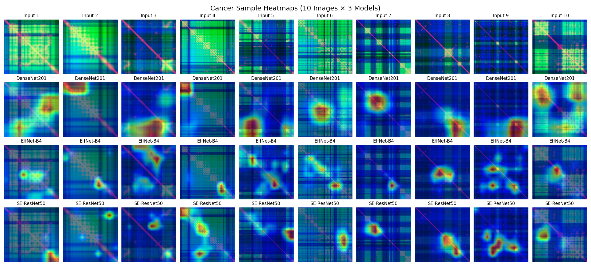
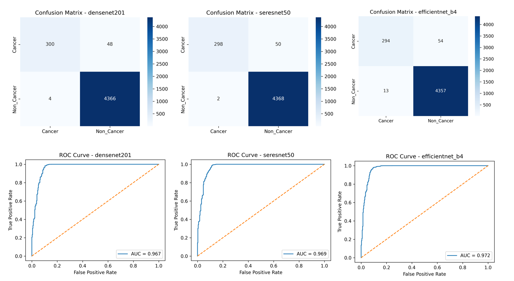

# 🧬 Protein Pre-Cancer Prediction Using CNN


> **An end-to-end AI system for predicting cancer-associated proteins using AlphaFold-generated 3D structures, RGB biophysical image encoding, ensemble CNN models, and Grad-CAM explainability.**

📌 Table of Contents

      1. Overview
      2. Motivation
      3. System Architecture
      4. Methodology
      5. Preprocessing Pipeline
      6. Model Architecture
      7. Training Strategy
      8. Visualization & Explainability
      9. Datasets Used
      10. Results
      11. Project Structure
      12. How to Run
      13. Requirements
      14. Limitations
      15. Future Enhancements
      16. License
      17. Acknowledgements

🔍 Overview

      This project presents a deep learning framework to predict whether a protein is cancer-associated based solely on its3D structural
      information. Instead of relying  on protein sequences or handcrafted biological features, the systemconverts protein structures into
      RGB biophysical images and classifies them using  an ensemble of convolutional neural networks.

🎯 Motivation

      Most traditional cancer protein prediction systems rely on sequence data or omics features,often ignoring 3D structural alterations
      caused by mutations. With the availability of high-quality protein structures from AlphaFold, this project aims to exploit structural 
      cues using modern deep learning techniques.

🏗 System Architecture

    The system consists of the following modules:
    Data Integration – OncoKB, UniProt, AlphaFold
    Preprocessing Engine – 3D to 2D biophysical encoding
    Dataset Management – Cancer vs Non-Cancer labeling
    Training Core – CNN ensemble training
    Visualization Layer – Grad-CAM and 3D protein viewer
    Deployment Layer – Streamlit web application

⚙ Methodology

    Collect cancer gene information from OncoKB and map them to UniProt identifiers.
    Download corresponding protein 3D structures from AlphaFold.
    Extract Cα atoms and confidence scores from .pdb files.
    Generate distance matrices, stability maps, and depth maps.
    Encode biophysical features into 299×299 RGB images.
    Train an ensemble of CNN models for binary classification.
    Perform inference with Grad-CAM explainability.

🧪 Preprocessing Pipeline

    Cα atom extraction from protein backbone
    Pairwise distance matrix computation
    B-factor (confidence) extraction
    Depth map calculation
    RGB channel encoding (Distance | Confidence | Depth)
    Padding and resizing to CNN-compatible format

🧠 Model Architecture

    The system uses an ensemble of three pretrained CNN models:
    DenseNet201 – Deep feature reuse and strong representation learning
    EfficientNet-B4 – Lightweight and computationally efficient
    SE-ResNet50 – Channel attention for enhanced feature importance

      Final predictions are obtained using ensemble averaging.

🏋 Training Strategy

    Train–Test Split: 80% / 20%
    Loss Function: Focal Loss
    Optimizer: Adam / AdamW
    Learning Rate Scheduler: Cosine Annealing
    Data Augmentation: Flips, rotations, normalization
    Class imbalance handled using weighted sampling

🔍 Visualization & Explainability

    Grad-CAM heatmaps highlight structurally important regions.
    3D protein viewer allows interactive inspection of structures.
    Model-wise probability distribution provides transparency.



## Testing Module

      The `For Testing` folder contains raw 3D protein input samples used to validate
      the CNN-based pre-cancer prediction model.

      Includes:
      - Raw protein structure files (.pdb )


🧬 Datasets Used

    OncoKB – Cancer gene annotations
    UniProt – Protein metadata and identifier mapping
    AlphaFold Protein Structure Database – 3D protein structures

📊 Results

    Accuracy: >98%
    Recall (Cancer class): >85%
    ROC-AUC: 0.97
    DenseNet201 and SE-ResNet50 show the best overall performance.


## 📁 Project Structure

```text
Protein_Pre_Cancer_Prediction/
├── preprocessing/
├── training/
├── models/
├── app/
├── data/
├── results/
├── README.md
├── requirements.txt
└── For Testing
```

▶ How to Run
    pip install -r requirements.txt
    streamlit run app/app.py

📦 Requirements

      Python 3.10+
      cuda 11.8
      PyTorch 2..7.1+cu11
      torchvision
      timm
      numpy
      opencv-python
      matplotlib
      streamlit
      pytorch-grad-cam
      py3Dmol

⚠ Limitations

    Binary classification only (Cancer vs Non-Cancer)
    Requires .pdb structure as input
    Does not classify specific cancer types

🚀 Future Enhancements

    Multi-class cancer type classification
    Sequence + structure hybrid models
    Mutation-level structural analysis
    Transformer-based protein models
    Clinical decision-support integration
